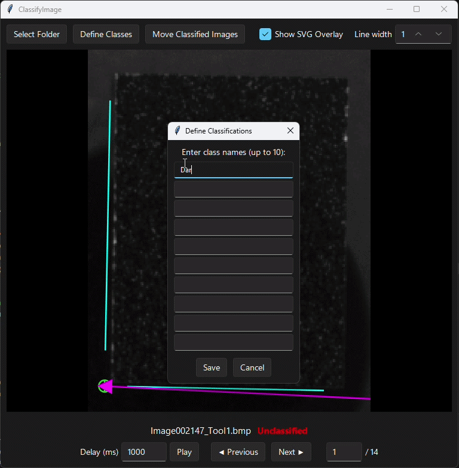

# ClassifyImage

ClassifyImage is a small desktop GUI for manually reviewing images, assigning each image to a class, and moving the classified files into corresponding subfolders.

## Features

- Browse to a folder containing JPG, JPEG, PNG, or BMP images and see the current folder in the app.
- Define zero to ten classification names, and press Enter to save them.
- Classify with buttons or number keys `1` through `9`.
- Automatically advance after classification.
- Navigate with the left and right arrow keys.
- Fit each image to the viewing window by default.
- Zoom with the mouse wheel and pan responsively by dragging, using pixel-preserving nearest-neighbor scaling.
- Double-click the mouse wheel to reset zoom and pan and fit the image to the viewing window.
- Automatically display an optional same-named SVG overlay (for example, `photo.svg` over `photo.png`).
- Set one screen-pixel line width for all stroked geometry, independent of image size and zoom, with proportionally scaled SVG markers and arrowheads.
- Set one screen-pixel text size for SVG labels, independent of image size and zoom.
- Automatically disable SVG sizing controls while the overlay is hidden.
- Play images automatically with a configurable delay and next-image prefetching for faster transitions.
- Inspect grouped file, image, embedded, and EXIF metadata in a collapsible side panel that follows navigation.
- Choose an explicit Move or Copy action for classified images, then transfer them into class-named subfolders with progress feedback.
- Warn before overwriting an existing destination filename.



## Requirements

- Python 3.10 or newer
- Tkinter, normally included with the Windows Python installer

SVG rendering is provided by a bundled Python wheel and does not require a separate Cairo or GTK installation.

## Setup on Windows PowerShell

```powershell
python -m venv .venv
.\.venv\Scripts\Activate.ps1
python -m pip install --upgrade pip
python -m pip install -e .
```

## Run

```powershell
python -m classify_image
```

Because the project uses a `src` layout, install it in editable mode first when running from a fresh clone:

```powershell
pip install -e .
classify-image
```

Without activating the virtual environment, run the generated launcher directly:

```powershell
.\.venv\Scripts\classify-image.exe
```

## Development

```powershell
python -m pip install -e ".[dev]"
python -m ruff check src tests
python -m ruff format --check src tests
python -m pytest
```

## Project layout

```text
ClassifyImage/
├── src/
│   └── classify_image/
│       ├── __init__.py
│       ├── __main__.py
│       └── app.py
├── tests/
│   └── test_package.py
├── .gitignore
├── pyproject.toml
└── README.md
```

## Notes

Classifications are held in memory until files are moved. Selecting a different source folder clears the current classification session.
